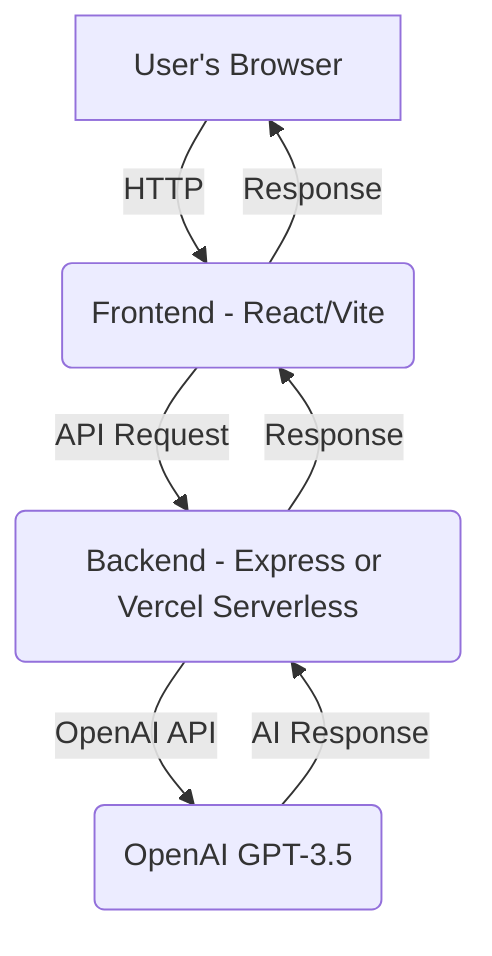

# HeyChat

HeyChat is a full-stack AI-powered chat application that allows users to interact with OpenAI's GPT-3.5-turbo model in real time. The project features a modern React + TypeScript frontend and an Express.js backend (or Vercel serverless functions) that securely proxies requests to the OpenAI API.

## Features
- Real-time chat interface with AI (OpenAI GPT-3.5-turbo)
- Modern, responsive UI built with React, TypeScript, and Tailwind CSS
- Backend server with Express.js for secure API key handling (or Vercel serverless functions)
- Easy local development and deployment with Docker Compose or Vercel
- Simple, extensible code structure

## Tech Stack
- **Frontend:** React, TypeScript, Vite, Tailwind CSS
- **Backend:** Node.js, Express.js (or Vercel serverless functions)
- **AI:** OpenAI GPT-3.5-turbo
- **Other:** Axios, Jest (testing), ESLint (linting)

## Getting Started

### Prerequisites
- [Docker](https://www.docker.com/get-started) and [Docker Compose](https://docs.docker.com/compose/) (for local development)
- [Vercel CLI](https://vercel.com/docs/cli) (for Vercel deployment)
- An OpenAI API key ([get one here](https://platform.openai.com/account/api-keys))

## Deployment Options

### 1. Running Locally with Docker Compose

1. **Clone the repository:**
   ```bash
   git clone <your-repo-url>
   cd HeyChat
   ```
2. **Set up environment variables:**
   - Create a `.env` file in the project root (same directory as `docker-compose.yml`) and add your OpenAI API key:
     ```
     OPENAI_API_KEY=your_openai_api_key
     ```
3. **Build and run with Docker Compose:**
   ```bash
   npm run up
   # or
   docker-compose up --build
   ```
   - The frontend will be available at [http://localhost:5173](http://localhost:5173)
   - The backend API will be available at [http://localhost:3000](http://localhost:3000)
4. **Stopping the app:**
   Press `Ctrl+C` in your terminal, then run:
   ```bash
   npm run down
   # or
   docker-compose down
   ```

### 2. Deploying to Vercel

1. **Push your code to GitHub.**
2. **Set up environment variables on Vercel:**
   - Go to your project on [Vercel Dashboard](https://vercel.com/dashboard).
   - Go to **Settings** → **Environment Variables**.
   - Add:
     - **Name:** `OPENAI_API_KEY`
     - **Value:** (your actual OpenAI API key)
     - **Environment:** Select all environments you want (Production, Preview, Development).
   - Click **Save**.
3. **Deploy via Vercel Dashboard:**
   - Click **Deployments**.
   - Click **Redeploy** on the latest commit, or push a new commit to your repo to trigger an automatic deployment.
   - Alternatively, deploy from your local machine:
     ```bash
     cd frontend
     npx vercel
     ```
4. **Check your deployment:**
   - After deployment, Vercel will give you a public URL (e.g., `https://your-project.vercel.app`).
   - Visit this URL and test your app.

## Usage
- Open [http://localhost:5173](http://localhost:5173) (local) or your Vercel URL in your browser.
- Type a message in the input box and press "Send".
- The AI will respond in the chat window.

## Project Structure
```
HeyChat/
  backend/            # Express backend (API proxy to OpenAI)
    index.js
    package.json
    ...
  frontend/           # React frontend source code
    src/              # All React code, components, etc.
    public/           # Static assets
    package.json
    index.html
    ...
  docker-compose.yml  # Docker Compose config
  .env                # Environment variables (not committed)
  README.md
  ...
```

## Architecture


## Testing
- **Frontend:**
  - Enter the `frontend` folder: `cd frontend`
  - Run tests: `npm test` (uses Jest and React Testing Library)
- **Backend:**
  - Enter the `backend` folder: `cd backend`
  - Run tests: `npm test` (add your own tests as needed)

## Contributing
Pull requests are welcome! For major changes, please open an issue first to discuss what you would like to change.

## License
[MIT](LICENSE)
