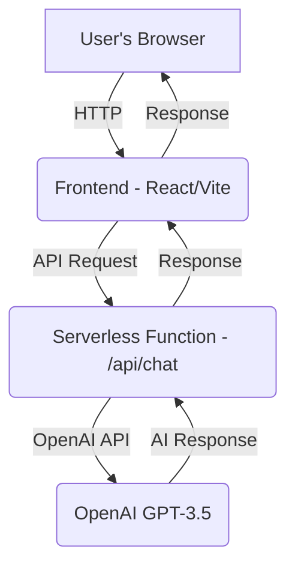

# HeyChat

HeyChat is a full-stack AI-powered chat application that allows users to interact with OpenAI's GPT-3.5-turbo model in real time. The project features a modern React + TypeScript frontend and Vercel serverless functions that securely proxy requests to the OpenAI API.

## Features
- Real-time chat interface with AI (OpenAI GPT-3.5-turbo)
- Modern, responsive UI built with React, TypeScript, and Tailwind CSS
- Secure API key handling via Vercel serverless functions
- Simple, extensible code structure
- Effortless deployment with Vercel

## Tech Stack
- **Frontend:** React, TypeScript, Vite, Tailwind CSS
- **Backend:** Vercel serverless functions (API routes)
- **AI:** OpenAI GPT-3.5-turbo
- **Other:** Axios, Jest (testing), ESLint (linting)

## Getting Started & Deployment (Vercel)

### Prerequisites
- [Vercel account](https://vercel.com/signup)
- [Vercel CLI](https://vercel.com/docs/cli) (optional, for local dev)
- An OpenAI API key ([get one here](https://platform.openai.com/account/api-keys))

### 1. Clone the repository
```bash
git clone <your-repo-url>
cd HeyChat/frontend
```

### 2. Set up environment variables on Vercel
- Go to your project on [Vercel Dashboard](https://vercel.com/dashboard).
- Go to **Settings** → **Environment Variables**.
- Add:
  - **Name:** `OPENAI_API_KEY`
  - **Value:** (your actual OpenAI API key)
  - **Environment:** Select all environments you want (Production, Preview, Development).
- Click **Save**.

### 3. Deploy to Vercel
- Push your code to GitHub (if not already).
- Import your project into Vercel and set the **Root Directory** to `frontend`.
- Vercel will automatically build and deploy your app.
- Alternatively, deploy from your local machine:
  ```bash
  npx vercel
  ```
- After deployment, Vercel will give you a public URL (e.g., `https://your-project.vercel.app`).

### 4. Local Development (Optional)
- Install dependencies:
  ```bash
  npm install
  ```
- Run locally with Vercel CLI:
  ```bash
  npx vercel dev
  ```
- Visit [http://localhost:3000](http://localhost:3000) to use the app locally.

## Usage
- Open your Vercel deployment URL (or [http://localhost:3000](http://localhost:3000) locally).
- Type a message in the input box and press "Send".
- The AI will respond in the chat window.

## Project Structure
```
HeyChat/
  frontend/           # React frontend source code and API routes
    src/              # All React code, components, etc.
    api/              # Vercel serverless functions (API routes)
      chat.ts         # Handles chat requests to OpenAI
    public/           # Static assets
    package.json
    index.html
    ...
  README.md
  ...
```

## Architecture


## Testing
- **Frontend:**
  - Enter the `frontend` folder: `cd frontend`
  - Run tests: `npm test` (uses Jest and React Testing Library)
- **API Functions:**
  - Add your own tests as needed for serverless functions

## Contributing
Pull requests are welcome! For major changes, please open an issue first to discuss what you would like to change.

## License
[MIT](LICENSE)
